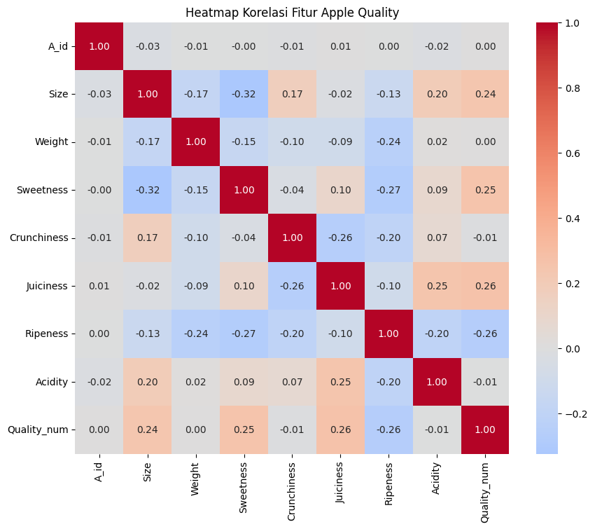

# Apple Quality Classification  
**Author:** Yanda Aziz Husein  
**Project Type:** Supervised Machine Learning – Classification  
**Repository:** [github.com/YandaAzizHusein/apple-quality-classification](https://github.com/YandaAzizHusein/apple-quality-classification)

---

## 1. Project Overview  

This project explores the application of supervised machine learning methods to automate the classification of apple quality (*good* vs *bad*) based on measurable physical and sensory characteristics.  
The objective is to demonstrate how data-driven models can support decision-making in precision agriculture by improving consistency, reducing subjectivity, and increasing operational efficiency.

The project adopts a complete data science workflow encompassing data preprocessing, feature analysis, model training, evaluation, and performance interpretation.

---

## 2. Business Context  

Manual fruit quality assessment in agricultural supply chains is often inconsistent and time-consuming.  
This project aims to address the following challenges:

- **Inconsistency in human judgment:** subjective evaluation may lead to unreliable quality control.  
- **Scalability limitation:** manual inspection cannot support large-scale sorting efficiently.  
- **Lack of automation:** industries require AI-driven solutions to standardize quality assessment.  

By developing a predictive model based on quantitative parameters such as size, sweetness, juiciness, and ripeness, this study showcases the potential of machine learning to enhance post-harvest processes.

---

## 3. Dataset Description  

- **Source:** [Apple Quality Dataset – Nidula Elgiriyewithana, Kaggle](https://www.kaggle.com/datasets/nelgiriyewithana/apple-quality)  
- **Number of Samples:** 4,000  
- **Attributes:** 9 (8 numerical predictors + 1 categorical target)  
- **Target Variable:** `Quality` (Good = 1, Bad = 0)  
- **Data Characteristics:** Clean, normalized, and balanced between classes.

| Feature | Description |
|----------|-------------|
| Size | Physical dimension of the apple |
| Weight | Total mass of the apple |
| Sweetness | Measured sugar level |
| Crunchiness | Texture intensity indicator |
| Juiciness | Moisture level of the fruit |
| Ripeness | Maturity stage of the fruit |
| Acidity | Acidic level measurement |
| Quality | Target variable indicating good or bad quality |

---

## 4. Methodology  

### Workflow  
The project follows a standard supervised learning pipeline:

**Data → Preprocessing → Modeling → Evaluation → Result**

### Analytical Stages  

1. **Data Understanding:** Exploratory Data Analysis (EDA), validation of missing values, and distribution checks.  
2. **Data Preparation:** Feature cleaning, correlation assessment, encoding categorical variables, and data partitioning (train/test split 80:20).  
3. **Modeling:** Implementation of three algorithms – Logistic Regression, Random Forest, and XGBoost.  
4. **Evaluation:** Comparison using accuracy, precision, recall, F1-score, and confusion matrix visualization.  
5. **Interpretation:** Determination of key features influencing quality prediction.

---

## 5. Exploratory Data Analysis  

### Target Distribution  
The dataset is balanced, with nearly equal representation of both quality categories.

.png)

### Feature Correlation  
Correlation analysis identifies four dominant predictors: Size, Sweetness, Juiciness, and Ripeness.

---

## 6. Modeling and Evaluation  

Three supervised classification algorithms were implemented and benchmarked:

| Model | Accuracy | Precision | Recall | F1-Score |
|:------|:---------:|:----------:|:--------:|:----------:|
| Logistic Regression | 0.7088 | 0.7098 | 0.7099 | 0.7094 |
| Random Forest | **0.7837** | **0.7871** | **0.7879** | **0.7875** |
| XGBoost | 0.7725 | 0.7770 | 0.7762 | 0.7761 |

**Key Observation:**  
Random Forest achieved the highest overall performance, indicating strong generalization capability without extensive parameter tuning.

### Confusion Matrices  

| Logistic Regression | Random Forest | XGBoost |
|:-------------------:|:--------------:|:--------:|
|  |  |  |

---

## 7. Key Insights  

- The Random Forest model yielded **accuracy of 78.37%**, outperforming Logistic Regression and XGBoost under the same conditions.  
- The most significant features for determining apple quality are **Size**, **Sweetness**, **Juiciness**, and **Ripeness**.  
- Machine learning successfully replicates expert-level quality assessment using objective, quantitative data.  

---

## 8. Future Work  

Potential areas for improvement include:

1. **Hyperparameter Optimization:** Apply grid search or Bayesian tuning for enhanced model precision.  
2. **Feature Engineering:** Explore non-linear feature interactions or polynomial transformations.  
3. **Image-Based Integration:** Extend model inputs with visual data (RGB/NIR imagery) to simulate real-world sorting systems.  
4. **Model Deployment:** Convert trained model into a cloud-hosted API or web-based dashboard for real-time quality inspection.

---

## 9. Technical Stack  

| Category | Technology |
|-----------|-------------|
| Programming | Python 3.10 |
| Data Handling | pandas, numpy |
| Visualization | matplotlib, seaborn |
| Machine Learning | scikit-learn, xgboost |
| Environment | Google Colab, Jupyter Notebook |
| Version Control | Git, GitHub |

---

## 10. Author Information  

**Yanda Aziz Husein**  
Machine Learning & Data Science Enthusiast  
[GitHub Profile](https://github.com/YandaAzizHusein)  
